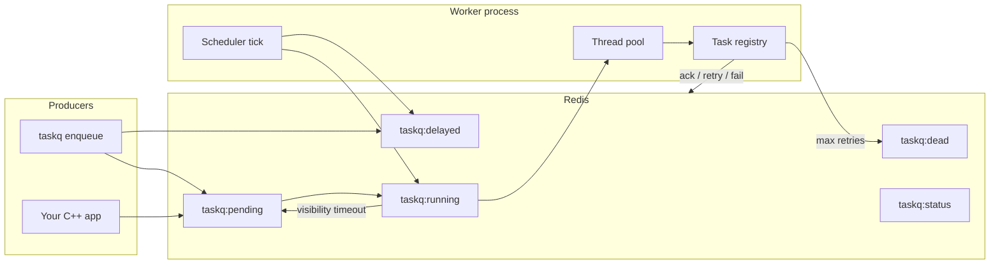

# CrunchyTask

C++20 distributed task queue **inspired by Celery**, built as a systems/portfolio project. Producers enqueue JSON tasks to Redis; worker processes reserve, execute registered handlers on a thread pool, and acknowledge results—with retries, delays, dead-letter handling, and crash recovery.

**Delivery guarantee: at-least-once.** A task may run more than once after a worker crash, visibility timeout, or retry. Handlers must be idempotent.

## Why this is not a Celery clone

Celery is a large Python ecosystem (routing, chords, groups, beat scheduler, result backends, monitoring, multiple brokers). CrunchyTask deliberately implements a **narrow slice**:

| In scope (MVP) | Out of scope |
|----------------|--------------|
| Enqueue / reserve / execute / ack | Celery protocol compatibility |
| Redis broker | RabbitMQ / Kafka backends |
| Retries + exponential backoff | Task chains, groups, chords |
| Delayed tasks | Distributed cron / beat |
| Dead-letter queue + CLI inspection | Web dashboard |
| Visibility timeout / crash recovery | Exactly-once execution |
| `taskq` CLI | Full Celery feature parity |

The goal is to demonstrate **C++ concurrency, broker design, and failure handling**—not to replace Celery in production Python apps.

## Architecture



**Scheduler tick** (each worker poll): promote due delayed tasks → reclaim stale running tasks → reserve from pending.

Redis also stores `taskq:results` (success payloads) and `taskq:failures` (latest failure reason per task id).

## Quick start

**Prerequisites:** CMake 3.24+, C++20 compiler, Docker (for Redis).

```bash
git clone <repo>
cd crunchytask

docker compose up -d redis

cmake -S . -B build
cmake --build build
```

**Build outputs:** `build/taskq` (CLI), `build/producer` (enqueue example), `build/taskqueue_tests`.

Default Redis URI: `tcp://127.0.0.1:6379` (override with `TASKQUEUE_REDIS_URI`).

### Demo (two terminals)

Start the **worker first**. Enqueued tasks stay `pending` until a worker reserves them.

Terminal 1 — worker:

```bash
docker compose up -d redis
./build/taskq worker start --concurrency 4
```

Terminal 2 — enqueue and inspect:

```bash
TASK_ID=$(./build/taskq enqueue add --payload '{"a":2,"b":3}')
./build/taskq status "$TASK_ID"
./build/taskq stats
```

Expected status after the worker runs:

```text
task_id: <uuid>
status: succeeded
result: {"result":5}
```

If `status` stays `pending`, confirm the worker is running in the other terminal and Redis is up.

## Example task: `add`

The CLI worker registers a built-in handler:

```text
task name: add
payload:   {"a": <int>, "b": <int>}
result:    {"result": a + b}
```

Enqueue:

```bash
./build/taskq enqueue add --payload '{"a":2,"b":3}'
```

Delayed enqueue (5 seconds):

```bash
./build/taskq enqueue add --payload '{"a":10,"b":1}' --delay-ms 5000
```

Programmatic enqueue (library): see `examples/producer.cc`.

## CLI reference

| Command | Description |
|---------|-------------|
| `taskq -V, --version` | Print version |
| `taskq enqueue <name> [--payload JSON] [--delay-ms N] [--redis URI]` | Enqueue task; prints task id |
| `taskq status <task_id> [--redis URI]` | Status, failure reason, result |
| `taskq stats [--redis URI]` | pending / delayed / running / dead counts |
| `taskq worker start [--concurrency N] [--visibility-timeout-ms N] [--redis URI]` | Run worker (default visibility timeout: 30s) |
| `taskq failed list [--redis URI]` | List dead-letter tasks |
| `taskq failed retry <task_id> [--redis URI]` | Requeue a dead task |

## Failure mode matrix

At-least-once delivery applies to several rows below: recovery may cause a task to run more than once. Handlers should be idempotent.

| Failure | Expected behavior | Recovery | Operational caveat |
|---------|-------------------|----------|-------------------|
| **Redis is down** | CLI and workers cannot enqueue, reserve, or update state; commands exit with an error. | Restore Redis, then retry the command or restart workers. | No queue durability while Redis is unavailable; unacked in-flight work depends on Redis persistence settings. |
| **Worker crashes after reserving a task** | Task stays in `running` with a `reserved_at` timestamp. | Scheduler reclaims the task after the visibility timeout (default 30s) and returns it to `pending` for another worker. | The handler may have partially run; duplicate execution is possible after reclaim. |
| **Handler returns failure** | Worker records a failure and calls `Retry` or `Fail` based on `max_retries`. | Retries go to the delayed queue with exponential backoff; exhausted retries move to the dead-letter queue. | Each failure increments retry metrics; permanent errors should fail fast or use `max_retries: 0`. |
| **Handler throws (uncaught exception)** | The worker thread aborts that task; no ack, retry, or fail is recorded. | Task remains `running` until visibility timeout reclaim, then follows the crash-after-reserve path. | Validate payloads in the handler and return `TaskResult::Failure`; do not rely on exceptions for control flow. |
| **Task exceeds visibility timeout** | Stale `running` task is treated as abandoned. | `ReclaimStaleTasks` moves it back to `pending` on the next scheduler tick. | Same duplicate-execution risk as a worker crash; tune `--visibility-timeout-ms` to your worst-case handler runtime. |
| **Producer enqueues malformed payload** | CLI rejects invalid JSON before enqueue (`invalid JSON payload`). Valid JSON with wrong fields may still enqueue. | Fix the payload and enqueue again; inspect bad tasks with `taskq status` / `taskq failed list`. | The CLI validates JSON syntax only, not task-specific schema; handlers must validate business fields. |
| **Retry attempts exhausted** | Task moves to the dead-letter queue; status becomes `dead`. | Inspect with `taskq failed list`; requeue manually via `taskq failed retry <task_id>`. | Dead-letter retry resets retry count but does not fix a permanently broken handler or payload. |
| **Delayed task is due, no worker running** | Task stays in the delayed queue until promoted. | Start a worker; scheduler tick promotes due tasks to `pending`, then they are reserved normally. | Due tasks do not run without a worker; monitor `stats` (`delayed` count) and worker heartbeats (`taskq workers list`). |

Legacy quick reference:

| Scenario | System behavior |
|----------|-----------------|
| Unknown task name | Immediate dead-letter (`taskq failed list`) |
| No worker running (immediate enqueue) | Task remains `pending` |
| Redis unavailable in tests | Integration tests skip gracefully |

## Tests

```bash
cmake --build build --target check          # full suite (88 tests)
ctest --test-dir build --output-on-failure  # same as check

./build/taskqueue_tests '~[integration]'    # unit only, no Redis
docker compose up -d redis
./build/taskqueue_tests '[integration]'     # Redis integration only
```

Integration tests use `TASKQUEUE_REDIS_URI` when set (default `tcp://127.0.0.1:6379`). They skip cleanly if Redis is not reachable.

## Benchmarks

Operational limit benchmarks live under `benchmarks/` and are **not** run by `check`.

```bash
docker compose up -d redis
cmake -S . -B build -DTASKQUEUE_BUILD_BENCHMARKS=ON
cmake --build build --target taskqueue_bench
./build/taskqueue_bench
```

Or use `./benchmarks/run_bench.sh`. Output is JSON (throughput, retry overhead, scheduling/reclaim latency). See [benchmarks/README.md](benchmarks/README.md).

## Roadmap

**MVP is complete** (queue, worker, Redis broker, retries, delays, dead-letter, crash recovery, CLI, tests).

Optional polish:

- Prometheus metrics and structured observability
- RabbitMQ or Protobuf wire format
- Priority queues and routing
- Worker heartbeat
