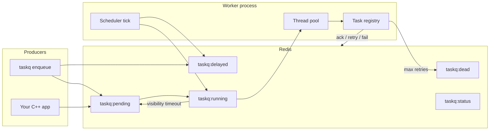

# CrunchyTask

C++20 distributed task queue **inspired by Celery**, built as a systems/portfolio project. Producers enqueue JSON tasks to Redis; worker processes reserve, execute registered handlers on a thread pool, and acknowledge results—with retries, delays, dead-letter handling, and crash recovery.

**Delivery guarantee: at-least-once.** A task may run more than once after a worker crash, visibility timeout, or retry. Handlers must be idempotent.

## Why this is not a Celery clone

Celery is a large Python ecosystem (routing, chords, groups, beat scheduler, result backends, monitoring, multiple brokers). CrunchyTask deliberately implements a **narrow slice**:

| In scope (MVP) | Out of scope |
|----------------|--------------|
| Enqueue / reserve / execute / ack | Celery protocol compatibility |
| Redis broker | RabbitMQ / Kafka backends |
| Retries + exponential backoff | Task chains, groups, chords |
| Delayed tasks | Distributed cron / beat |
| Dead-letter queue + CLI inspection | Web dashboard |
| Visibility timeout / crash recovery | Exactly-once execution |
| `taskq` CLI | Full Celery feature parity |

The goal is to demonstrate **C++ concurrency, broker design, and failure handling**—not to replace Celery in production Python apps.

## Architecture



**Scheduler tick** (each worker poll): promote due delayed tasks → reclaim stale running tasks → reserve from pending.

Redis also stores `taskq:results` (success payloads) and `taskq:failures` (latest failure reason per task id).

## Quick start

**Prerequisites:** CMake 3.24+, C++20 compiler, Docker (for Redis).

```bash
git clone <repo>
cd crunchytask

docker compose up -d redis

cmake -S . -B build
cmake --build build
```

**Build outputs:** `build/taskq` (CLI), `build/producer` (enqueue example), `build/taskqueue_tests`.

Default Redis URI: `tcp://127.0.0.1:6379` (override with `TASKQUEUE_REDIS_URI`).

### Demo (two terminals)

Start the **worker first**. Enqueued tasks stay `pending` until a worker reserves them.

Terminal 1 — worker:

```bash
docker compose up -d redis
./build/taskq worker start --concurrency 4
```

Terminal 2 — enqueue and inspect:

```bash
TASK_ID=$(./build/taskq enqueue add --payload '{"a":2,"b":3}')
./build/taskq status "$TASK_ID"
./build/taskq stats
```

Expected status after the worker runs:

```text
task_id: <uuid>
status: succeeded
result: {"result":5}
```

If `status` stays `pending`, confirm the worker is running in the other terminal and Redis is up.

## Example task: `add`

The CLI worker registers a built-in handler:

```text
task name: add
payload:   {"a": <int>, "b": <int>}
result:    {"result": a + b}
```

Enqueue:

```bash
./build/taskq enqueue add --payload '{"a":2,"b":3}'
```

Delayed enqueue (5 seconds):

```bash
./build/taskq enqueue add --payload '{"a":10,"b":1}' --delay-ms 5000
```

Programmatic enqueue (library): see `examples/producer.cc`.

## CLI reference

| Command | Description |
|---------|-------------|
| `taskq -V, --version` | Print version |
| `taskq enqueue <name> [--payload JSON] [--delay-ms N] [--redis URI]` | Enqueue task; prints task id |
| `taskq status <task_id> [--redis URI]` | Status, failure reason, result |
| `taskq stats [--redis URI]` | pending / delayed / running / dead counts |
| `taskq worker start [--concurrency N] [--visibility-timeout-ms N] [--redis URI]` | Run worker (default visibility timeout: 30s) |
| `taskq failed list [--redis URI]` | List dead-letter tasks |
| `taskq failed retry <task_id> [--redis URI]` | Requeue a dead task |

## Failure modes

| Scenario | System behavior |
|----------|-----------------|
| Handler returns error | Retry with exponential backoff until `max_retries` |
| Retries exhausted | Task moves to dead-letter queue (`taskq failed list`) |
| Unknown task name | Immediate fail (dead letter) |
| Worker crash after reserve | After visibility timeout, task returns to pending (may run again) |
| Redis unavailable | CLI errors; integration tests skip gracefully |
| No worker running | Task remains `pending` in queue |

## Tests

```bash
cmake --build build --target check          # full suite (56 tests)
ctest --test-dir build --output-on-failure  # same as check

./build/taskqueue_tests '~[integration]'    # unit only, no Redis
docker compose up -d redis
./build/taskqueue_tests '[integration]'     # Redis integration only
```

Integration tests use `TASKQUEUE_REDIS_URI` when set (default `tcp://127.0.0.1:6379`). They skip cleanly if Redis is not reachable.

## Roadmap

**MVP is complete** (queue, worker, Redis broker, retries, delays, dead-letter, crash recovery, CLI, tests).

Optional polish:

- Prometheus metrics and structured observability
- Benchmarks
- RabbitMQ or Protobuf wire format
- Priority queues and routing
- Worker heartbeat
