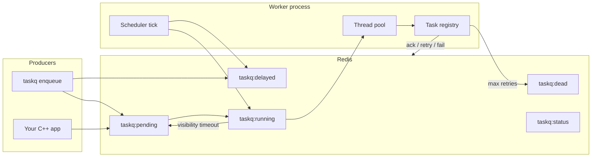

# CrunchyTask

A small C++20 task queue backed by Redis. You enqueue JSON jobs from the CLI or your own code; worker processes pull work, run registered handlers on a thread pool, and write results back. Retries, delays, dead-lettering, and basic crash recovery are in there too.

**Delivery is at-least-once** — if a worker dies mid-task or a visibility timeout fires, the same job might run again. Write handlers so that is OK.

I built this as a systems/portfolio project to get my hands dirty with concurrency, a real broker, and the boring failure cases (retries, stale leases, DLQ) rather than only happy-path demos.

**Releases:** [v0.1.0](https://github.com/crunchytask/crunchytask/releases/tag/v0.1.0) is the first public release. The next patch, **v0.1.1**, will focus on further Redis atomicity polish — see [CHANGELOG.md](CHANGELOG.md).

## What it does

- Enqueue named tasks with a JSON payload (`taskq enqueue`)
- Workers reserve work from Redis and execute on a thread pool
- Retries with exponential backoff; optional delay before first run
- Dead-letter queue when retries are exhausted (`taskq failed list` / `retry`)
- Per-task retry policy on enqueue (`--retry-policy` JSON)
- Visibility timeout so crashed workers do not strand tasks forever
- Worker heartbeats in Redis (`taskq workers list`)
- Basic metrics (`taskq metrics`, Prometheus or plain text)
- `taskq` CLI for enqueue, status, results, stats, workers, and running a worker

Not trying to be a full job platform: no web UI, no distributed cron, no exactly-once guarantees, no RabbitMQ/Kafka backends (Redis only for now). Good enough to learn from and to wire into a C++ service.

There is also a thin Python producer client under [`clients/python/`](clients/python/README.md) (wraps the `taskq` binary; no Python worker).

## Architecture



Each worker poll: promote due delayed tasks → reclaim stale running tasks → reserve from pending.

Redis also holds `taskq:results` (success payloads), `taskq:failures` (latest error per task id), `taskq:workers:<id>` (worker heartbeats), and `taskq:metrics` (counters/histograms).

## Build and install

**You need:** CMake 3.24+, a C++20 compiler, Docker if you want the bundled Redis compose file.

```bash
git clone https://github.com/crunchytask/crunchytask.git
cd crunchytask

cmake -S . -B build
cmake --build build
```

Outputs in `build/`:

- `taskq` — CLI
- `libtaskqueue.a` — library
- `producer` — enqueue example (if examples are on)
- `taskqueue_tests` — tests (if tests are on)

Default Redis: `tcp://127.0.0.1:6379`. Override with `TASKQUEUE_REDIS_URI` (see [.env.example](.env.example)).

### Install locally

```bash
cmake --build build
cmake --install build --prefix ~/.local --component taskqueue
```

Use `--component taskqueue` so you only install this project’s artifacts (not FetchContent deps like hiredis/redis++).

On many Linux boxes libraries end up under `lib64/`:

```text
~/.local/bin/taskq
~/.local/lib64/libtaskqueue.a
~/.local/include/taskqueue/*.h
~/.local/lib64/cmake/taskqueue/taskqueue-config.cmake
```

Custom prefix works too, e.g. `/usr/local`:

```bash
sudo cmake --install build --prefix /usr/local --component taskqueue
```

After install, put the bin dir on your PATH:

```bash
export PATH="$HOME/.local/bin:$PATH"
taskq --version
taskq worker start
```

### Use from another CMake project

```cmake
find_package(taskqueue CONFIG REQUIRED)
target_link_libraries(my_app PRIVATE taskqueue::taskqueue)
```

If Redis support was enabled at build time, you also need `nlohmann_json`, `spdlog`, and `redis++` visible to CMake (`find_dependency` runs from the config).

### Uninstall / clean

CMake has no uninstall target. To remove what you installed:

```bash
xargs rm -vf < build/install_manifest.txt
```

Nuke and reconfigure:

```bash
rm -rf build
cmake -S . -B build
cmake --build build
```

Turn off install rules if you are packaging differently:

```bash
cmake -S . -B build -DTASKQUEUE_ENABLE_INSTALL=OFF
```

## Quick start

Start the **worker first**. Tasks sit in `pending` until something reserves them.

Terminal 1:

```bash
docker compose up -d redis
./build/taskq worker start --concurrency 4
```

Terminal 2:

```bash
TASK_ID=$(./build/taskq enqueue add --payload '{"a":2,"b":3}')
./build/taskq status "$TASK_ID"
./build/taskq stats
```

You should see something like:

```text
task_id: <uuid>
status: succeeded
result: {"result":5}
```

If it stays `pending`, check that Redis is up and the worker is still running in the other terminal.

## Example task: `add`

The stock worker registers a trivial handler:

```text
task name: add
payload:   {"a": <int>, "b": <int>}
result:    {"result": a + b}
```

```bash
./build/taskq enqueue add --payload '{"a":2,"b":3}'
```

Delayed by 5 seconds:

```bash
./build/taskq enqueue add --payload '{"a":10,"b":1}' --delay-ms 5000
```

Library usage: `examples/producer.cc`.

## CLI reference

| Command | Description |
|---------|-------------|
| `taskq -V, --version` | Print version |
| `taskq enqueue <name> [--payload JSON] [--delay-ms N] [--retry-policy JSON] [--redis URI]` | Enqueue; prints task id |
| `taskq status <task_id> [--format text\|json] [--redis URI]` | Status, failure reason, result |
| `taskq result <task_id> [--format text\|json] [--redis URI]` | Result payload only |
| `taskq stats [--redis URI]` | pending / delayed / running / dead counts |
| `taskq worker start [--concurrency N] [--visibility-timeout-ms N] [--redis URI]` | Run worker (default visibility: 30s) |
| `taskq workers list [--redis URI]` | Active workers (from heartbeats) |
| `taskq metrics [--format prometheus\|plain] [--redis URI]` | Queue metrics snapshot |
| `taskq failed list [--format text\|json] [--redis URI]` | Dead-letter tasks |
| `taskq failed retry <task_id> [--redis URI]` | Requeue a dead task |

## When things go wrong

Same at-least-once story everywhere: recovery can mean duplicate runs. Design for that.

| Situation | What happens |
|-----------|----------------|
| Redis down | Enqueue/reserve/status fail until Redis is back. |
| Worker dies after reserve | Reserve is atomic (Lua): pending → `running` with `reserved_at_ms`. If reserve succeeded, the task stays in `running` until visibility timeout (default 30s), then reclaim returns it to `pending`. |
| Handler returns failure (or throws) | Treated as failure; retries with backoff until `max_retries`, then dead-letter. Exceptions are caught and turned into failures. |
| Handler runs longer than visibility timeout | Reclaimed as stale; may run twice. Tune `--visibility-timeout-ms`. |
| Bad JSON on CLI | Rejected at enqueue. Wrong field types still enqueue — validate in the handler. |
| Retries exhausted | `dead`; use `taskq failed list` and `taskq failed retry`. |
| Delayed task, no worker | Stays delayed until a worker promotes it on the next tick. |
| Unknown task name | Goes straight to dead-letter. |
| No worker (immediate enqueue) | Stays `pending`. |

## Tests

```bash
cmake --build build --target check          # full suite (~100 tests)
ctest --test-dir build --output-on-failure

./build/taskqueue_tests '~[integration]'    # unit only
docker compose up -d redis
./build/taskqueue_tests '[integration]'     # needs Redis
```

Integration tests honor `TASKQUEUE_REDIS_URI` and skip if Redis is not reachable.

## Benchmarks

Under `benchmarks/` — not part of `check`.

```bash
docker compose up -d redis
cmake -S . -B build -DTASKQUEUE_BUILD_BENCHMARKS=ON
cmake --build build --target taskqueue_bench
./build/taskqueue_bench
```

Or `./benchmarks/run_bench.sh`. JSON output (throughput, retry overhead, scheduling/reclaim latency). Details in [benchmarks/README.md](benchmarks/README.md).

## Roadmap

**v0.1.0 (released):** core queue, Redis broker with Phase A atomic Lua transitions, worker/CLI, retries, delays, DLQ, crash recovery, heartbeats, metrics, benchmarks, Python client, and tests.

**v0.1.1 (in progress):** Phase B atomicity polish on the Redis broker (ack, dead-letter retry, enqueue transactions); no public API changes planned.

**Later:** another broker backend, priority queues / routing, richer observability (dashboards, alerting hooks).
